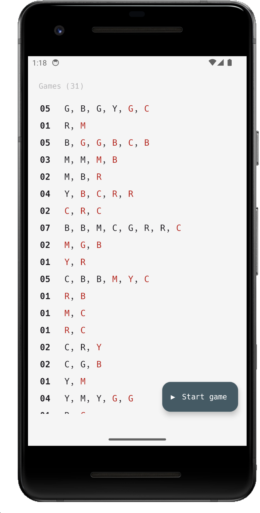
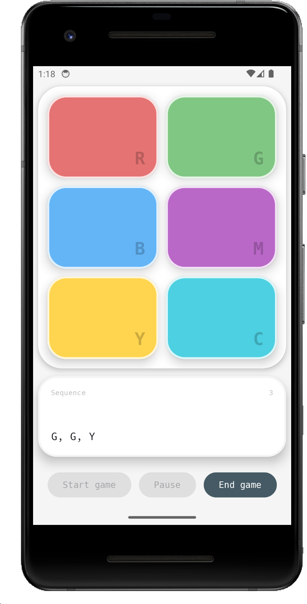

  
  <h1>MemoryCore</h1>

Variante del gioco Simon, progetto per il corso di Programmazione di Sistemi Embedded (a.a. 2025-26).

## Screenshot

  
  
  

## Dispositivo di sviluppo

- Emulatore: Pixel 2
- API Level: Level 34 (Android 14)
- Services: Google  APIs
- ABI: arm64-v8a

## Problemi
- Premendo rapidamente il pulsante `End Game`, potrebbero essere salvate più partite vuote.
